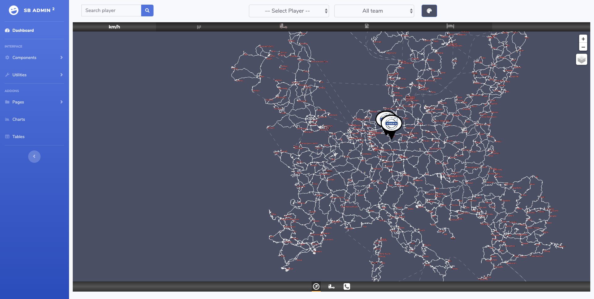
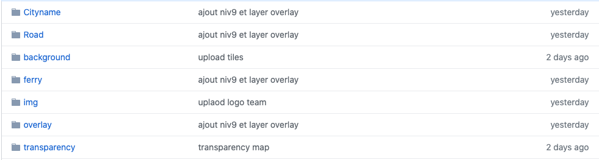

# Fet-map

## Show off

https://fet-map.herokuapp.com/



## Tiles

https://github.com/victorsmits/Fet-Tiles



## JSON

### Connected Players ID

```json
{
    "id" : 0
}
```

- *id* : Id of a player connected to Promods

### Player position
```json
{
    "Name" : "String",
    "Player" : "String",
    "x": 0,
    "y": 0,
    "Team": "String"
}
```

- *Name* : Player steam name.
- *Player* : In game player name.
- *x* : x position in game.
- *y* : y position in game.
- *Team* : truck brand.

### Player data
```json
{
	"online": 1,
	"truck": {
		"speed": 0,
		"fuel": 0,
		"fuelCapacity": 0,
		"wearEngine": 0,
		"wearTransmission": 0,
		"wearCabin":0,
		"wearChassis": 0,
		"wearWheels": 0
	},
	"trailer": {
		"wear": 0,
		"mass": 0,
		"attached": 1
	},
	"cargo": {
		"wear": 0
	},
	"job": {
		"income": 0,
		"destCity": "String",
		"destCompany": "String"
	}
}
```

- *online* : Player connected.
- *truck* : Truck data.
	- *speed* : Truck speed.
	- *fuel* : Truck fuel.
	- *fuelCapacity* : Truck fuel capacity.
	- *wearEngine* : Truck engine damage.
	- *wearTransmission* : Truck transmission damage.
	- *wearCabin* : Truck cabin damage.
	- *wearChassis* : Truck chassis damage.
	- *wearWheels* : Truck wheels damage.
- *trailer* : Trailer data.
	- *wear* : Trailer damage.
	- *mass* : Mass of trailler in kg.
	- *attached* : Trailler attached to the Truck.
- *cargo* : Cargo data.
	- *wear* : Cargo damage.
- *job* : Mission data.
	- *income* : income of the mission.
	- *destCity* : City of destination.
	- *destCompany* : Company of destination.

## To add/import

### Import in head

***leaflet import***

import at the top of the head
```html
    <link rel="stylesheet" href="https://unpkg.com/leaflet@1.6.0/dist/leaflet.css"
          integrity="sha512-xwE/Az9zrjBIphAcBb3F6JVqxf46+CDLwfLMHloNu6KEQCAWi6HcDUbeOfBIptF7tcCzusKFjFw2yuvEpDL9wQ=="
          crossorigin=""/>

    <!-- Make sure you put this AFTER Leaflet's CSS -->
    <script src="https://unpkg.com/leaflet@1.6.0/dist/leaflet.js"></script>


    <!-- Note: if this demo gets incorporated into ets2-mobile-route-advisor, I'd recommend including a copy of these files. That way, it will work even without Internet connection. -->
    <link rel="stylesheet" href="https://cdnjs.cloudflare.com/ajax/libs/leaflet/1.0.0-beta.1/leaflet.css"/>
``` 

import at the bottom of the head
```html
<script src="https://cdn.jsdelivr.net/npm/@jaames/iro@5"></script>
```


### Import at the end of body

```html
<script src="https://cdn.jsdelivr.net/gh/victorsmits/Fet-map/Dashboard.js"></script>
<script src="https://cdn.jsdelivr.net/gh/victorsmits/Fet-map/fet.js"></script>
```

## UPDATE 
- [css/fet.css](css/fet.css)

## Map integration

### map 
From line : 287 to 490 in [index.html](https://github.com/victorsmits/Fet-map/blob/f7b2beee3fadb8c1a6ae4c178d08ce66d46823de/index.html#L287-L476)


### Control

#### search bar    _line : 185_

````html
<form class="d-none d-sm-inline-block form-inline mr-auto ml-md-3 my-2 my-md-0 mw-100" id="searchForm">
    <div class="input-group">
        <input type="text" class="form-control bg-light border-1 small"
               placeholder="Search player"
               aria-label="Search"
               aria-describedby="basic-addon2"
               id="search">
        <div class="input-group-append">
            <button class="btn btn-primary" type="submit">
                <i class="fas fa-search fa-sm"></i>
            </button>
        </div>
    </div>
</form>
````

#### selector    _line : 204_

`````html
<select class="selector form-control bg-light border-1 small" id="playerSelector"
        style="margin-right: 1em;">
    <option value="-">–- Select Player --</option>
</select>
<select class="selector form-control bg-light border-1 small" id="TeamSelector">
    <option value="all">All team</option>
</select>
`````

#### color picker modal _line : 174_

```html
<div class="modal fade" id="exampleModal" tabindex="-2" role="dialog"
     aria-labelledby="exampleModalLabel" aria-hidden="true">
    <div class="modal-dialog" role="document">
        <div class="modal-content">
            <div class="modal-body picker-position">
                <div id="picker" onmouseup="colorUpdate()"></div>
            </div>
        </div>
    </div>
</div>
```

#### color picker bouton _line : 225_

```html
<button class="btn btn-primary btn-icon-split" id="openPicker" data-toggle="modal"
        data-placement="right" data-target="#exampleModal"
        title="Changer le fond de la carte"><i class="fas fa-palette"></i>
</button>
`````

